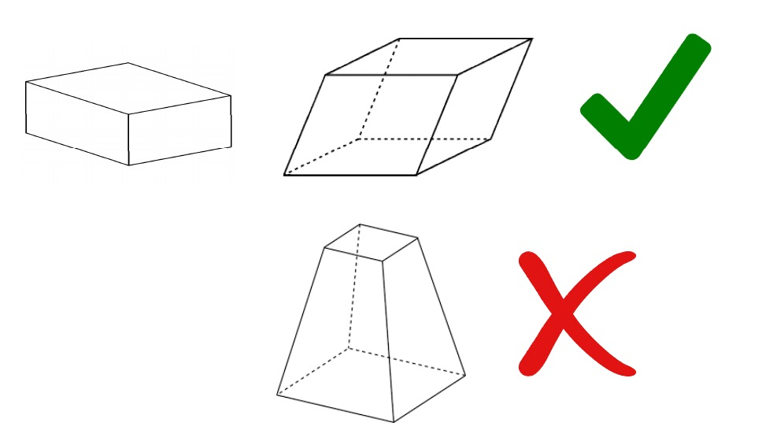

.. toctree::
   :maxdepth: 2

bmwBoxMesh
============

This Python script can be used to mesh geometries where all the faces of the closed box are parallel to the respective opposite face, that is, the box is made up of three pairs of parallel faces.

Location
--------

BMW>boxMesh

Usage
-----
    
* Once we have some entities loaded in our ANSA session (hot points, points or nodes which are going to be our input as the corners of the box), we can call the function boxMesh() by clicking on the button “Box Mesh“.
* Once the button is clicked, ANSA will prompt us to pick either 4 hot points or 3D points or nodes or combination of any or all of these to define the 3 dimensions of the box we wish to have as a meshed box.
* These 4 points must be selected in a continuous contour. Imagine if you were to have an isometric sketch of a parallelepiped box on a paper and you had to go from one corner to the other 3 times such that, these 4 corners traversed cover all the 3 dimensions of the box without lifting your pen off the paper.
* If it sounds a bit complicated at the moment, images on the next few pages will give you a clear idea as to how to pick the 4 points in a correct order. Of course, there are more than one ways to do this.
* The simplest way to go about picking the points is to pick any 3 points on any one face of the box in either clockwise or anti-clockwise manner. These 3 points by now will have covered 2 dimensions of the box. Now pick the 4th point such that it covers the remaining 3rd dimension of the box originating from the 3rd point you picked.

.. image:: images/example_02.jpg
    :width: 400pt
    :align: center

    
Requirements
------------

.. warning::
    
    No special requirements.
    
* designed for ANSA V.19.1.1

Revision history
----------------

Application revision history overview.

.. toctree::
   :maxdepth: 2

   revision_history.rst
