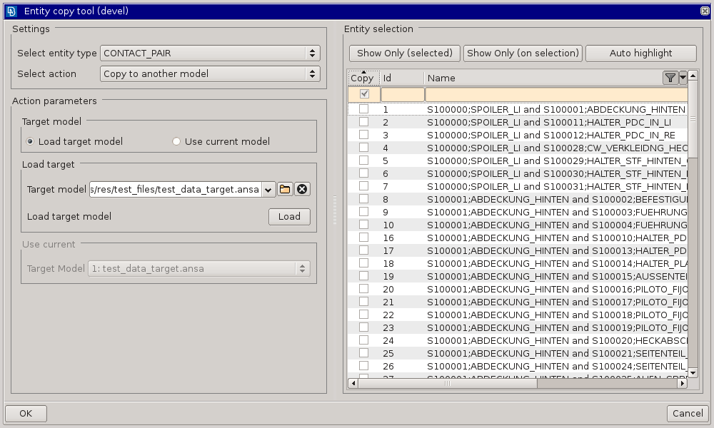

.. toctree::
   :maxdepth: 2

copyEntity
===============

	
tool for creating symmetrical contacts/sets or copying contacts/sets from source model to another model.

Description
-----------

* based on ANSA GEB entity creates symmetrical master and slave set
* copies parent set and updates new symmetrical master and slave sets

Location
--------

Tools>copyEntity

Usage
-----

* select type of entity to be processed
* select action to be executed
* select (check) items of the selected type from the list 
* run

Requirements
------------

.. warning::
    
    designed for ANSA V.19.1.1

Revision history
----------------

Application revision history overview.

.. toctree::
   :maxdepth: 2

   revision_history.rst
