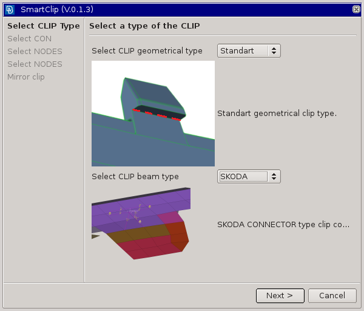

smart clip documentation
=========================

    
.. toctree::
   :maxdepth: 2
   

SmartClip
=========

is a tool to make the clip definition as easy as possible.

About
-----

According to the guiding CON that must be selected by a user, searches for normals of neighbour faces and defines a base
coordinate system orientation. Projects points to its boundaries in the correspondent vectors and searches for their projection to
the clip contra part. Measures projection distance and defines CONNECTOR STOP property.
In the second step, the user is requested to select nodes for the beam definition connecting the connector element with the clip
itself and the contra part.

Requirements
------------

.. warning::
    
    When run as a plugin, ANSA 18.0.1 and newer must be used! This is due to a bug in version 17.x.x

* SmartClip requires geometry and FEM model loaded into the one session.
* At least the clip part geometry has to be meshed (the finer the mesh is the more accurate is the stop distances mechanism).
    

Usage
-----

1. select guiding CON
2. select nodes connecting the connector element and the clip contra part
3. select nodes connecting the connector element and the clip itself
4. an option to create a symmetrical clip automatically

Best practice
-------------
    
* Keep FEM model visible (visib switch on) in the time of guiding CON selection.
* Try to reduce model geometry and avoid large faces (cut them if necessary). That will significantly reduce the time for clip creation.
	

Revision history
----------------

Application revision history overview.

.. toctree::
   :maxdepth: 2

   revision_history

