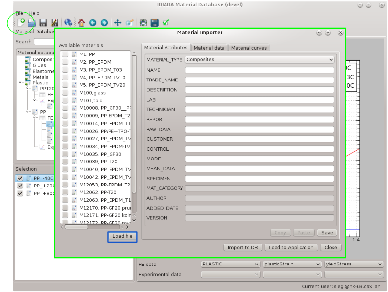
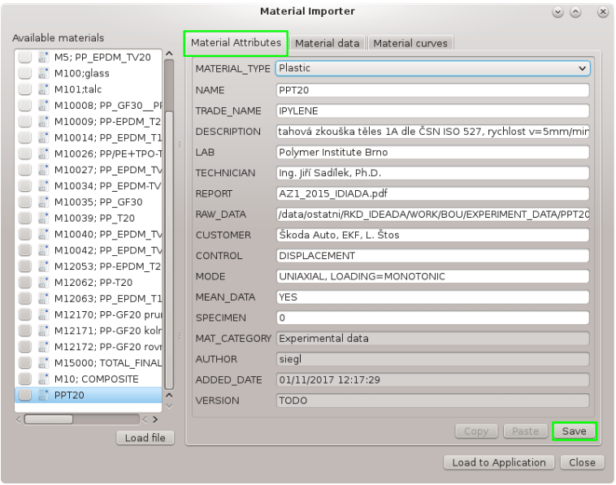
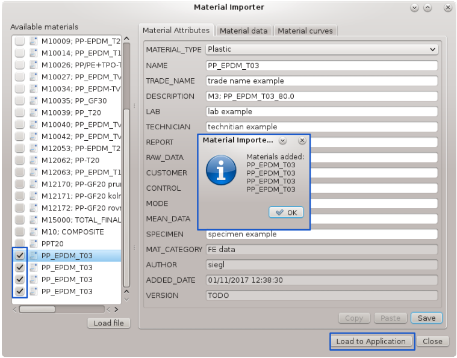
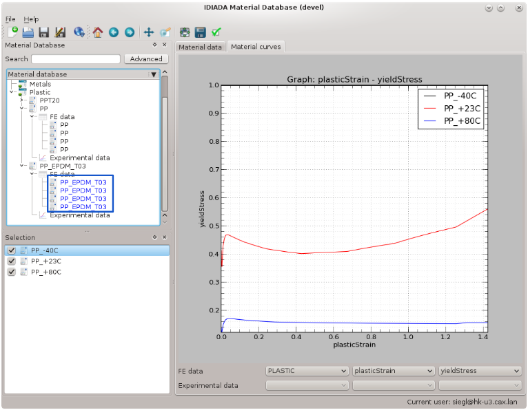

Material import
===============

Material import in handled by the Material Importer dialog.

Select file
-----------

1. open Material Importer by clicking the "import material" icon on toolbar
2. click "Load file" button and select particular file with material definition.

.. note::
	
	There are currently three file types supported.
	
	* FE data ABAQUS *.inp or *.inc files
	* Experimental data format *.txt

.. note::
	
	All materials from loaded files will be added to Material Importer "Available materials" window.

Fill in material attributes
---------------------------

	
1. select material
2. fill attributes
3. click save

.. note::
	
	There are "Copy" and "Paste" buttons. These might be helpful when importing more materials to
	make the attribute filling a bit easier.

Import desired materials
------------------------

	
1. select materials for import
2. click "Load to Application" button

.. note::
	
	New imported materials will marked blue in the list of materials.

