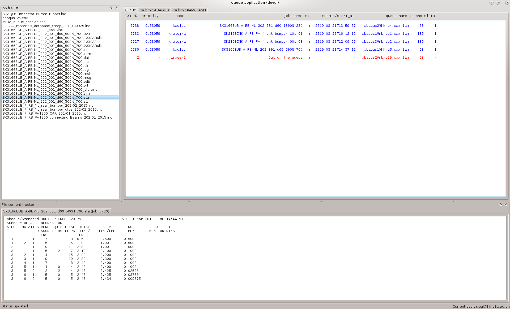
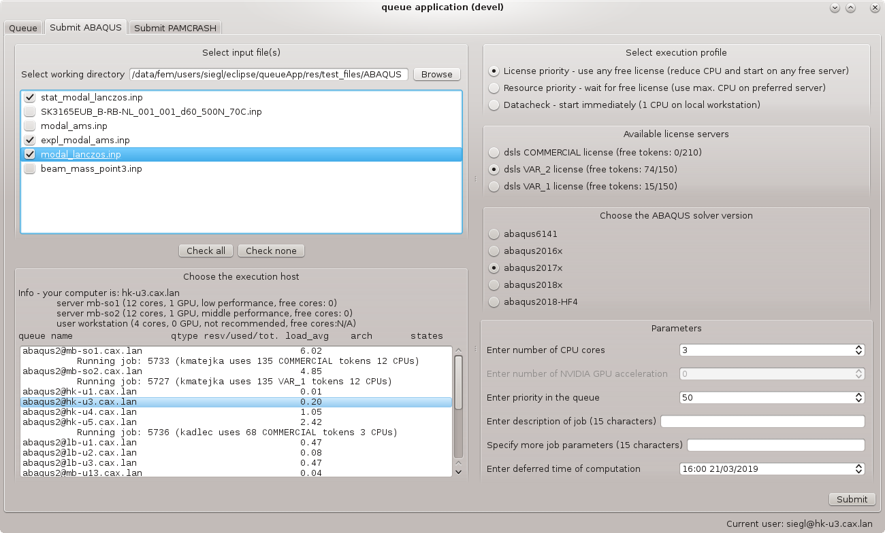
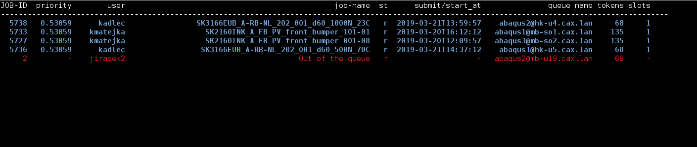
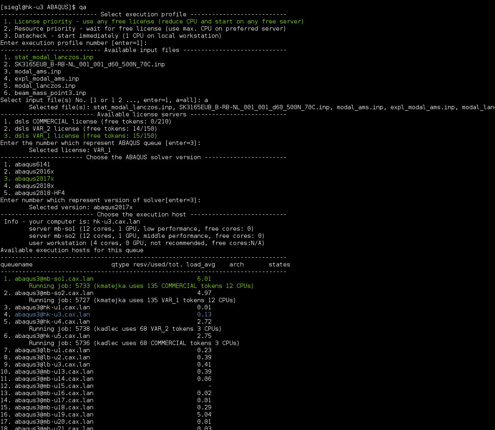

queueApp documentation
======================

.. toctree::
   :maxdepth: 2

Queue Application
=================

Monitors and submits jobs for Grid Engine. There are multiple input 
interfaces that can control application functionality.

Input interface
---------------

* qq - graphical interface
* q  - text based overview of Grid Engine jobs statuses 
* qa + no input parameters - text based interactive submit for ABAQUS
* qa + input parameters - command line based submit for ABAQUS
* qp + no input parameters - text based interactive submit for PAMCRASH
* qp + input parameters - command line based submit for PAMCRASH

Job submitting
--------------

is based on execution profiles that provide default options (based on 
available resources), standard preferred execution settings or 
can simplify input parameters (e.g. datacheck).

Usage
=====

qq
--

graphical interface providing the complete tool functionality::

    qq

Queue monitor:

Submitting tools:

q
--

text based overview of Grid Engine jobs statuses::

    q

qa
--

submits ABAQUS job to Grid Engine::

    qa [-h] [-inp [inp_path [inp_path ...]]]
               [-license {COMMERCIAL,VAR_2,VAR_1}]
               [-solver {abaqus6141,abaqus2016x,abaqus2017x,abaqus2018x,abaqus2018-HF4}]
               [-host {hk-u1,hk-u3,hk-u4,hk-u5,lb-u1,lb-u2,lb-u3,mb-so1,mb-so2,mb-u13,mb-u14,mb-u15,mb-u16,mb-u17,mb-u18,mb-u19,mb-u20,mb-u21,mb-u22,mb-u23,mb-u24,mb-u26}]
               [-cpu CPU] [-gpu GPU] [-prio PRIO] [-start START] [-des DES]
               [-param PARAM]
    
    
    optional arguments:
      -h, --help            show this help message and exit
      -inp [inp_path [inp_path ...]]
                            ABAQUS Input file path.
      -license {COMMERCIAL,VAR_2,VAR_1}
                            ABAQUS license server type. (default=COMMERCIAL)
      -solver {abaqus6141,abaqus2016x,abaqus2017x,abaqus2018x,abaqus2018-HF4}
                            ABAQUS solver version. (default=abaqus2017x)
      -host {hk-u1,hk-u3,hk-u4,hk-u5,lb-u1,lb-u2,lb-u3,mb-so1,mb-so2,mb-u13,mb-u14,mb-u15,mb-u16,mb-u17,mb-u18,mb-u19,mb-u20,mb-u21,mb-u22,mb-u23,mb-u24,mb-u26}
                            Calculation host. (default=mb-so2)
      -cpu CPU              Number of CPUs. (default=4)
      -gpu GPU              Number of GPUs. (default=0)
      -prio PRIO            Job priority. (default=50)
      -start START          Job start time. (default=mmddHHMM)
      -des DES              Job description (max. 15 characters).
      -param PARAM          Additional ABAQUS parameters: "-x y -xx yy" (max 15
                            characters).
 
qp
--

submits PAMCRASH job to Grid Engine::

    qp [-h] [-pc inp_path] [-host {mb-so1,mb-so2,mb-so3}] [-cpu CPU]
               [-gpu GPU] [-prio PRIO] [-start START] [-des DES] [-param PARAM]
    
    optional arguments:
      -h, --help            show this help message and exit
      -pc inp_path          PAMCRASH Input file path.
      -host {mb-so1,mb-so2,mb-so3}
                            Calculation host. (default=mb-so3)
      -cpu CPU              Number of CPUs. (default=4)
      -gpu GPU              Number of GPUs. (default=0)
      -prio PRIO            Job priority. (default=50)
      -start START          Job start time. (default=mmddHHMM)
      -des DES              Job description (max. 15 characters).
      -param PARAM          Additional ABAQUS parameters: "-x y -xx yy" (max 15
                            characters).

qn
--

submits NASTRAN job to Grid Engine::

    qn [-h] [-bdf inp_path] [-solver {NASTRAN nas20171}]
              [-host {mb-so1,mb-so2}] [-prio PRIO] [-start START] [-des DES]
              [-param PARAM]
    
    optional arguments:
      -h, --help            show this help message and exit
      -bdf inp_path         NASTRAN Input file path.
      -solver {NASTRAN nas20171}
                            NASTRAN solver version. (default=NASTRAN nas20171)
      -host {mb-so1,mb-so2}
                            Calculation host. (default=mb-so3)
      -prio PRIO            Job priority. (default=50)
      -start START          Job start time. (default=05301530)
      -des DES              Job description (max. 15 characters).
      -param PARAM          Additional ABAQUS parameters: "-x y -xx yy" (max 15
                            characters).

Revision history
----------------

Application revision history overview.

.. toctree::
   :maxdepth: 2

   revision_history.rst
