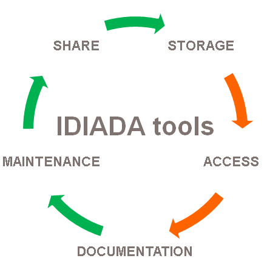
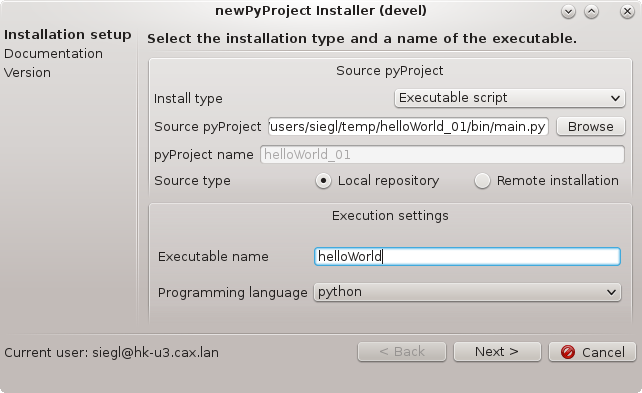

pyProjectTools documentation
============================
    
.. toctree::
   :maxdepth: 2
    

    
pyProjectTools
==============

    
Is a package of tools which are supposed to be used to create, install and document python-based scripts.

Usage
-----

usage::

    pyProjectTools [-h] [-initiateAnsaToolkit] [-initiateDoc]
    
    optional arguments:
      -h, --help            show this help message and exit
      -initiateAnsaToolkit  Initiates ansa_toolkit data structure (a package for
                            user user script buttons, plugins and checks loading
                            to ANSA).
      -initiateDoc          Initiates IDIADA tools documentation data structure.

newPyProject
============

Creates a new python project template according to the given target project type. 
This project is supposed to be installed into standard project structure using pyProjectInstaller.  

* creates a default project structure
* creates a default sphinx documentation which will be generated from the documentation string of the main.py file
* initiates a git repository

Usage
-----

usage::

    newPyProject [-h] [-wrap script_path] [-ansaCheck] [-ansaButton] [-metaSession] projectName [project_path]
    
    positional arguments:
      projectName        Project name.
      project_path       New project location. (Default=Current directory)

    optional arguments:
      -h, --help         show this help message and exit
      -wrap script_path  Automatically wraps given executable script with a
                     newPyProject of given name. This project can be
                     directly installed using pyProjectInstaller.
      -ansaCheck         Creates an ANSA check template. Please be aware that in
                     order to use pyProjectInstaller the new created check
                     file name must contain a prefix: check_*.py
      -ansaButton        Creates an ANSA user script button template. This project
                     can be directly added to ANSA using pyProjectInstaller.
      -metaSession       Creates a META session template. This project can be
                     directly added to META using pyProjectInstaller.

pyProjectInstaller
==================

    
Python script for pyProject installation. According to the given 
installation type (executable script, ANSA button, ANSA check, META button) handles
all corresponding procedures:

* installs pyProject to the default project structure
* installs a default sphinx documentation based on main.py documentation string
* handles the git repository versions

Usage
-----

usage::

    pyProjectInstaller 

It is possible to use either "Local repository" or "Remote installation" 
as a source for installation.
    
    * Local repository type - pyProject to be installed has its repository (by script development)
    * Remote installation type - pyProject to be installed has been received from other business unit (by installation of an existing tool)

doc
===

Tool that generates a IDIADA tool documentation overview using SPHINX

Usage
-----

usage::

    doc [-h] [-init] [-update] [-sync]

    optional arguments:
      -h, --help  show this help message and exit
      -init       Clones existing IDIADA tool documentation files from github
                  master repository and sets remote origin.
      -update     Creates documentation html content from source documentation
                  files.
      -sync       Synchonises source documentation files with the master
                  repository.

Revision history
----------------

Application revision history overview.

.. toctree::
   :maxdepth: 2

   revision_history