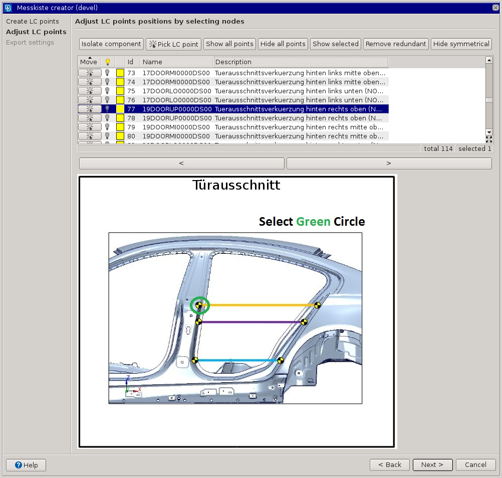

.. toctree::
   :maxdepth: 2

BMW Messkiste
=============

Python script for *.sensors file creating used in *.sensors-xlsm-cfg-inc "Messkiste" workflow.

Create LC Points step
---------------------

* creates LC points from existing CONNECTOR entities in current model, messkiste.inc file or from a template
* assignes information from a template file based on the particular CONNECTOR id (Comment attribute - connecotr description)
* moves LC point positions against pyramid base element direction for best target mesh fitting

Adjust LC points step
---------------------

* user is supposed to align LC points to their proper position with a help of target position preview

Export *.sensors step
---------------------

* collects LC points with status OK and searches their Interface nodes coordinates
* node coordinates are moved automatically for the best target pyramid connection
* missing symmetrical points are added automatically
* position rules are applied to the point coordinates for the best target result
* writes a new "xxx.sensors" file which is possible to import to "Messkisten_Configurator.xlsm" file by "Import Sensorsliste" button

Location
--------

BMW>messkiste

Usage
-----

* open model
* create LC ponts using one of the options: "Create", "Import" or "Insert"
* check and adjust LC point positions
* Export .sensors file using Export .sensors step
* import sensors fole into "Messkisten_Configurator.xlsm" file by "Import Sensorsliste" button

.. note::
	
	Since the missing symmetrical LC points are created automatically, it is not necessary to position all LC points. Use "Hide symmetrical" 
	button to identify points which will can be areated automatically.

Requirements
------------

.. warning::
    
    Requires ANSA V.18.x.x on.

Revision history
----------------

Application revision history overview.

.. toctree::
   :maxdepth: 2

   revision_history.rst
